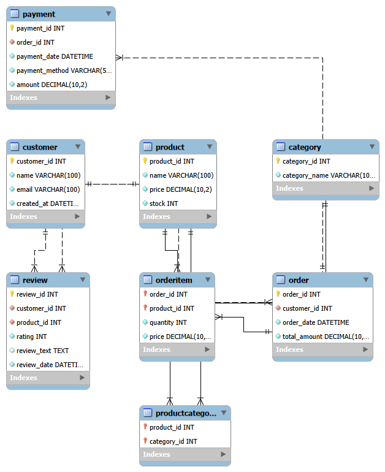

# Online Marketplace Database System

A large-scale MySQL-based online marketplace database project developed for CSE 535: Database Systems. The project focuses on normalized relational schema design, synthetic data generation, analytical SQL querying, and baseline query benchmarking.


# Project Overview

This project models a realistic online marketplace platform containing customers, products, categories, orders, payments, reviews, and transactional relationships.

The system was designed to:
- Support large-scale analytical queries
- Maintain normalized relational integrity
- Simulate realistic transactional behavior
- Establish baseline query performance for future optimization

The database contains over 1.43 million rows generated using Python and Faker.


# Features

- Normalized relational schema design (3NF)
- Large-scale synthetic data generation
- MySQL relational database implementation
- Complex analytical SQL queries
- Benchmarking and runtime analysis
- Multi-table joins and aggregations
- Subqueries, EXISTS, self joins, and cross joins


# Technologies Used

- MySQL
- Python
- Faker
- NumPy
- Pandas
- Jupyter Notebook


# Database Schema

The schema includes the following tables:

- Customer
- Product
- Category
- ProductCategory
- Order
- OrderItem
- Payment
- Review

The database was designed using proper:
- Primary keys
- Foreign keys
- Relational constraints
- Many-to-many relationships
- Referential integrity rules

## Entity Relationship Diagram




# Dataset Scale

| Table | Rows |
|---|---|
| Customer | 100,000 |
| Product | 10,000 |
| Category | 10 |
| ProductCategory | 20,000 |
| Order | 300,000 |
| OrderItem | 600,000 |
| Payment | 300,000 |
| Review | 100,000 |

Total dataset size exceeds 1.43 million rows.


# Baseline Analytical Queries

The project includes 19 analytical SQL queries involving:

- Multi-table joins
- Aggregations
- HAVING clauses
- Trend analysis
- EXISTS operations
- Self joins
- Cross joins
- Revenue analysis
- Product pair analysis

Example analytical questions:
- Who are the most frequent customers?
- Which products generate the highest revenue?
- Which products were never sold?
- What are the monthly revenue trends?
- Which products are frequently bought together?


# Benchmarking

Each query was executed 10 times using Python benchmarking scripts.

Collected metrics:
- Average runtime
- Standard deviation
- Individual query runtimes

The benchmarking results establish baseline performance for future optimization work in Project 2.

# Repository Structure

```text
online-marketplace-database-system/
│
├── README.md
├── .gitignore
├── requirements.txt
├── LICENSE
│
├── schema/
│   └── marketplace_schema.sql
│
├── data_generation/
│   └── data_generation.ipynb
│
├── queries/
│   └── baseline_marketplace_queries.sql
│
├── benchmarking/
│   ├── benchmarking.ipynb
│   └── benchmark_results.csv
│
├── report/
│   └── Ghosh_Rupa_1st_Project_Report.pdf
│
├── docs/
│   └── figures/
│
└── screenshots/
```


# How to Run

## 1. Create Database

Run:

SOURCE schema/marketplace_schema.sql;


## 2. Generate Data

Run the notebook:

data_generation/data_generation.ipynb


## 3. Execute Queries

Run:

queries/baseline_marketplace_queries.sql


## 4. Run Benchmarking

Execute:

benchmarking/benchmarking.ipynb


